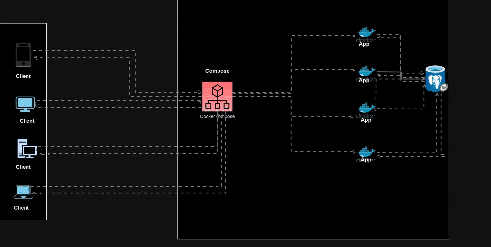
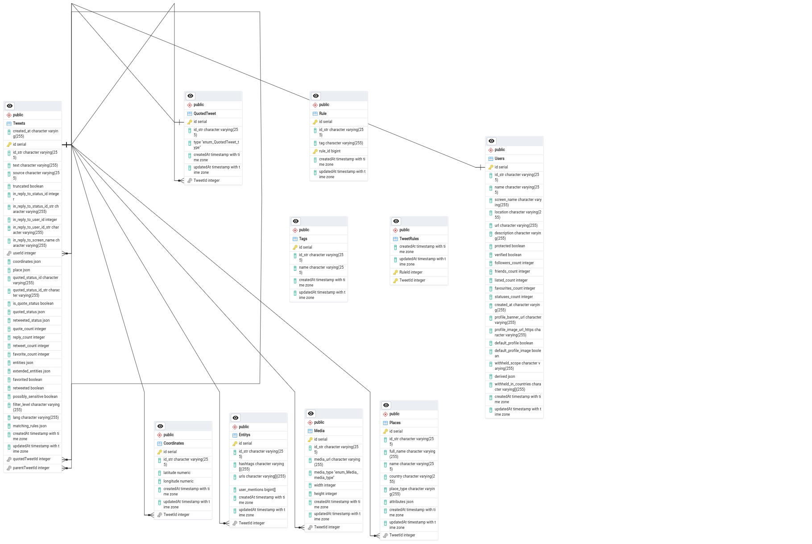

# Twitter User Recommendation API

This project implements a Web Tier using Restful API for user contact recommendations from Twitter data using Node.js, Express, PostgreSQL, and Docker.

## Project Overview

This backend project is built using a Node.js/Express application with TypeScript. It includes development tools like Nodemon for auto-reloading during development and Docker for containerized deployment. Additionally, it integrates Swagger for API documentation and Jest for testing.

## Implanted Deployment Architecture



# Web Tier

The web tier handling the API requests runs as a Node.js cluster to improve performance and utilization.

## Key Highlights

- Implements a Node.js cluster with worker processes
- Allows utilization of all CPU cores
- Horizontal scaling of web processes
- Load-balanced processing of incoming requests
- Improved throughput over single process
- By leveraging Node.js clustering and running a worker process per CPU core, the service can handle high request volumes and traffic spikes more efficiently.

`Requests are automatically distributed across all workers allowing better horizontal utilization. Adding more application servers will also add to capacity by simply adding more worker cluster nodes.`

## Metrics are tracked per cluster worker including:

- Request throughput
- Response times
- Memory usage
- CPU saturation

### Auto-scaling policies can utilize these metrics to scale out workers based on load. Clustering improves scalability and throughput while easing capacity planning.

# Storage Tier

1. PostgreSQL database
2. Containerized using Docker
3. Stores cleaned Twitter data
4. Query optimizations for efficiency
5. Jenkins pipeline to transform & scripting application

## Database Design

The database design is optimized for high performance with considerations for indexing, normalization, partitioning, and data types. And i choose to use PostgresSQL database because of its benefits over other SQL databases.

### Entity Relationship Diagram(ERD)



# Features

- Retrieve ranked list of user contacts based on scoring algos
- Custom processing of large (100MB+) Twitter dataset by seeding them
- Meet throughput requirements under load tests
- Designed for cost optimized usage
- Use of PostgreSQL arrays, JSONB for unstructured data

## Prerequisites

## Essentials

    - Docker installed (for containerized deployment)
    - Docker Compose installed (for managing containerized images)

Before you begin testing locally, ensure you have met the following requirements:

    - Node.js and npm installed locally
    - PostgreSQL database installed
    - Make installed
    - Basic knowledge of TypeScript, Node.js, and Express

## Getting Started

1. **Clone the Repository:**

   ```bash
   git clone https://github.com/Nkbtemmy/Twitter-analysis.git
   cd Twitter-analysis-backend
   Open Terminal in current directory
   Run `make start`
   Then open your browser and start explore
   ```

## Installation & Usage locally

### Configuration

    Environment variables and configuration settings can be managed in `.env` or `.env.example`.


      - npm run `dev` from development or
      - npm run `ts:dev` and
      - npm run `start` for production while did npm run `build`

## API Documentation (Swagger):

When the server is up and running open your browser and navigate to http://localhost:3000/ to access the Swagger documentation for your API.

## Project Structure

- `src/` Contains my TypeScript source code.
- - `controllers/` Contains my TypeScript controller code.
- - `services/` Contains my TypeScript application logic code.
- - `database/` Contains my database schema and configurations.
- - - `config/` Contains my database configuration and connection code.
- - - `migrations/` Contains my blueprint of database tables.
- - - `models/` Contains database models(Entities).
- - - `seeders/` Contains database seeders.
- - `docs/` Contains Swagger documentation codes.
- - `middlewares/` Contains middlewares codes.
- - `routers/` Contains endpoints routers code.
- - `utils/` Contains re-usable code.
- - - `helpers/` Contains helper function codes.
- - - - `files/` Contains files like datasets provided.
- - `server.ts` Contains the server code and it is the main file of the project.

- `build/` - Compiled TypeScript code (generated when building).

# Technology Stack:

    - `Node js` Engine
    - `Express/Typescrity` Framework
    - `PostgresSQL` Database
    - `Sequelize` ORM
    - `Docker` for Containilization

# CI/CD Pipelines

The service utilizes Jenkins for continuous integration and delivery workflows including:

## Development Pipeline

    Run unit tests
    Build Docker images
    Validate Swagger docs
    Push images to Docker registry
    Deploy to dev environment
    Production Pipeline

### Automated version tagging

    Run integration tests
    Container image upgrade
    Zero downtime deploy
    Traffic shift
    Monitoring and rollback
    Jenkins enables automating testing, Docker build/deploy.

## Deployment

This app will be deployed on the OnRender server.
